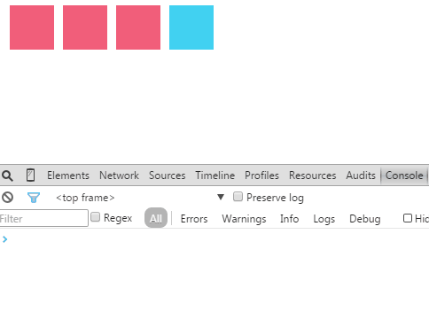

#Event Delegation 事件委派
##範例
Event Delegation (事件委派) 是一種受惠於Event Bubbling而能減少監聽器數目的方法。

	

	    

	    

	    

		

	

	$('.parent').on('click', '.child', function(){
	    console.log($(this).data('name'));   
	});

[完整程式碼](event_delegation.html)

##程式碼解說
當我們click不同的小區塊時，就會console出它們個別的名字，例如：a、b或c。  

實作方法是將click事件綁在parent上，藉由Event Bubbling來傳遞給child，而非直接將事件綁定在child上。優點是可減少監聽器的數目，缺點是由於需要判斷哪些child node是我們有興趣的項目，而必須多寫一些程式碼做判斷。在本例中，我們加上一個filter 「.child」，表示只對有 「.child」這個class的節點有興趣，而沒有加上 「.child」的節點則不被影響，例如click「.subitem」這個節點之後就不會console它的名字。  

##Demo

---
####推薦閱讀
- [Event delegation | JavaScript Tutorial](http://javascript.info/tutorial/event-delegation)
- [Bubbling and capturing | JavaScript Tutorial](http://javascript.info/tutorial/bubbling-and-capturing)