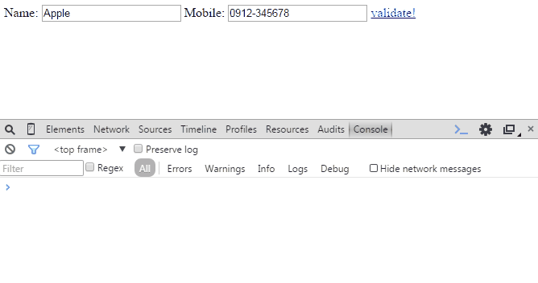

#Strategy 策略模式
JavaScript Design Pattern 「Strategy 策略模式」 筆記。  

策略模式將各個方法封裝起來，在執行期間選擇適當的演算法。  

##範例
假設我們想驗證一些資料，其中想驗證各欄位

- 是否為空(isNonEmpty)
- 是否只填數字(isNumber)
- 是否只填英數(isAlphaNum)
- 是否為Email(isEmail)
- 字串大小是否在最小範圍內，設定為3個characters以上(minSize)
- 字串大小是否在最大範圍內，設定為10個characters以內(maxSize)

我們可以使用傳統的「Switch-Case」或「If-Else」寫法(如下)，但若需求變更則必須回來維護這段程式碼 (參考自[深入理解JavaScript系列（33）：設計模式之策略模式- 湯姆大叔- 博客園](http://www.cnblogs.com/TomXu/archive/2012/03/05/2358552.html))。

	//一般的寫法
	validator = {
	    validate: function(value, type) {
	        switch (type) {
	            case 'isNonEmpty':
	            {
	                return true;
	            }
	            case 'isNumber':
	            {
	                return true; 
	            }
	            case 'isAlphaNum':
	            {
	                return true; 
	            }
	            default:
	            {
	                return true;
	            }
	        }
	    }
	}; 
	//測試 
	var result = validator.validate("123", "isNonEmpty");
	console.log(result); //ture

比較好的寫法是使用「Strategy 策略模式」，單獨定義演算方式，不僅容易維護，也方便測試，

###程式碼解說
改寫上面的資料驗證程式碼。

	var validator = {
		types: {}, //所有的驗證規則皆會存放於此，稍後會個別定義
		messages: [], //個別驗證類型的錯誤訊息
		config: {}, //使用者資料各欄位需要被驗證的類型
		validate: function (data) { // 使用者資料 - 欄位:值
			var i,
				msg,
				type,
				checker,
				result_ok;
			this.messages = []; //清空所有的錯誤信息
	
			for(i in data) {
				if(data.hasOwnProperty(i)) { //判斷使用者欄位是否需要被驗證
					type = this.config[i]; //如果需要被驗證，則取出相對應的驗證規則
					checker = this.types[type];
					if(!type) {
						continue; //如果驗證規則不存在，則不處理
					}
					if(!checker) { //如果驗證規則類不存在，拋出異常
						throw {
							name: "ValidationError",
							message: "No handler to validate type " + type
						};
					}
					result_ok = checker.validate(data[i]); //驗證
					if(!result_ok) { //取得錯誤訊息
						msg = "Invalid value for *" + i + "*, " + checker.instructions;
						this.messages.push(msg);
					}
				}
			}
			return this.hasErrors();
		},
		//helper
		hasErrors:function () {
			return this.messages.length !== 0;
		}
	};
	
	//個別定義驗證規則
	//欄位值不可為空
	validator.types.isNonEmpty = {
		validate:function (value) {
			return value !== "";
		},
		instructions: "the value cannot be empty"
	};
	
	//欄位值只能為數字
	validator.types.isNumber = {
		validate:function (value) {
			return !isNaN(value);
		},
		instructions: "the value can only be a valid number, e.g. 1, 3.14 or 2010"
	};
	
	//欄位值是否為英數組合
	validator.types.isAlphaNum = {
		validate:function (value) {
			return !/[^a-z0-9]/i.test(value);
		},
		instructions: "the value can only contain characters and numbers, no special symbols"
	};
	
	//欄位值是否為Email
	validator.types.isEmail = {
		validate: function(value){
			var re = /^([\w-]+(?:\.[\w-]+)*)@((?:[\w-]+\.)*\w[\w-]{0,66})\.([a-z]{2,6}(?:\.[a-z]{2})?)$/i;
	    	return re.test(value);		
		},
		instructions: 'use valid email format, e.g. @'
	};
	
	//欄位值有最小長度限制，字串大小是否在最小範圍內，設定為3個characters以上(minSize)
	validator.types.minSize = {
		validate: function(value){
	    	return value.length >= 3;		
		},
		instructions: 'min size is 3 characters'
	};
	
	//欄位值有最大長度限制，字串大小是否在最大範圍內，設定為10個characters以內(maxSize)
	validator.types.maxSize = {
		validate: function(value){
			return value.length <= 10;
		},
		instructions: 'max size is 10 characters'
	};
	
	//測試資料
	var data = {
		first_name: 'Super',
		last_name: 'Man',
		age: 'unknown',
		username: 'o_O',
		email: 'example@gmail.com',
		confirm_email: 'invalid_email_sample',
		password: '12'
	};
	
	//定義測試資料每個欄位需要被驗證的類型
	validator.config = {
		first_name: 'isNonEmpty',
		last_name: 'maxSize',
		age: 'isNumber',
		username: 'isAlphaNum',
		email: 'isEmail',
		confirm_email: 'isEmail',
		password: 'minSize'	
	};
	
	//若有錯誤，則console出錯誤訊息
	validator.validate(data);
	if (validator.hasErrors()) {
		console.log(validator.messages.join("\n"));
	}

[看程式碼](strategy.html)。

###Demo
console視窗顯示訊息如下：  

	Invalid value for *age*, the value can only be a valid number, e.g. 1, 3.14 or 2010
	Invalid value for *username*, the value can only contain characters and numbers, no special symbols
	Invalid value for *confirm_email*, use valid email format, e.g. @
	Invalid value for *password*, min size is 3 characters

##簡單改寫為Plugin
  

Name欄位是要被檢測的，檢測條件為不可為空，而Mobile欄位不被檢測。因此當Name欄位有值("Apple"或"Hello"時)，出現訊息「Everything is OK!」表示通過驗證；而Name欄位無值的時候，則出現錯誤訊息「Invalid value for *fieldName*, the value cannot be empty」。

[看程式碼](strategy_form_validate.html)。

---
####推薦閱讀
- [深入理解JavaScript系列（33）：設計模式之策略模式- 湯姆大叔- 博客園](http://www.cnblogs.com/TomXu/archive/2012/03/05/2358552.html)